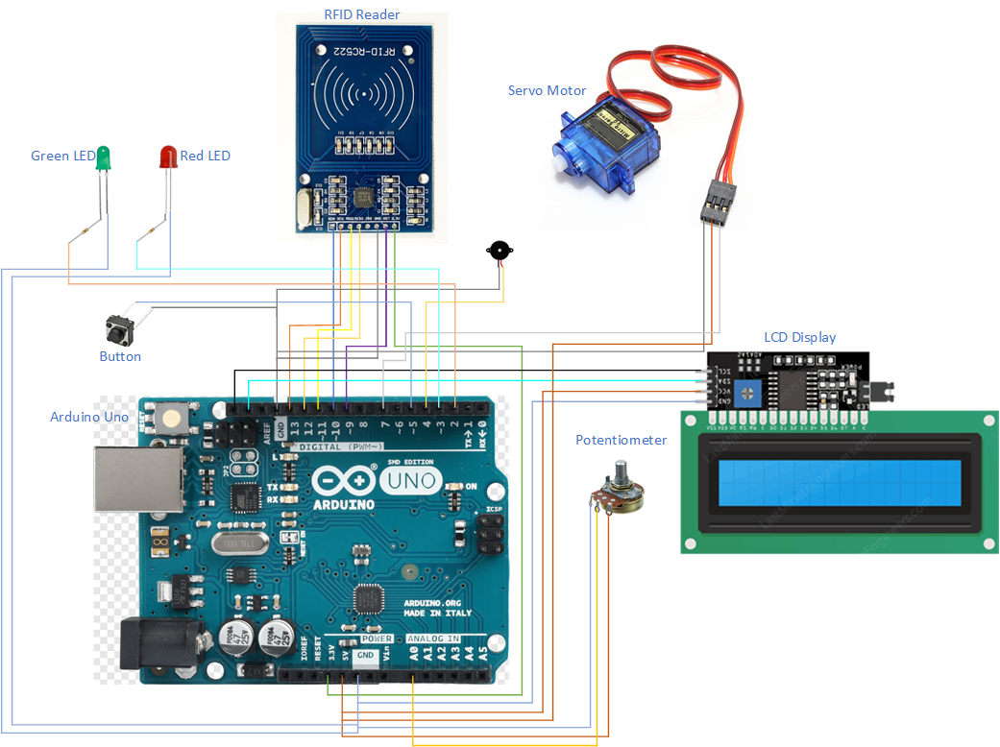
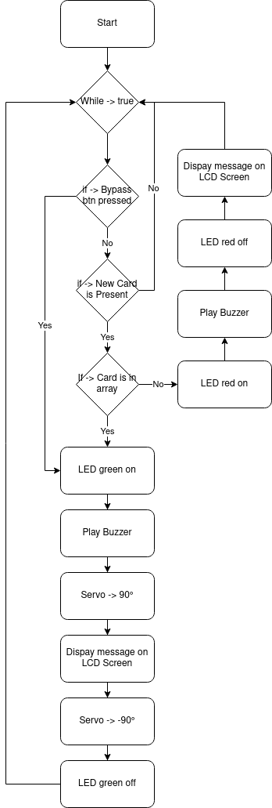
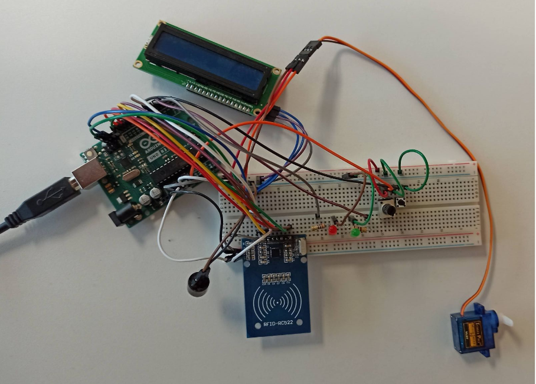

# M242 - MIKROPROZESSORANWENDUNG REALISIEREN

By Aaron G. & M. J.

03.2021

## Erläuterung des Auftrages

Im Modul 242 Mikroprozessoranwendung realisieren war das Ziel, ein eigenes Projekt mit dem Arduino zu planen, umzusetzen und zu dokumentieren.

## Planung

__Anforderungen__

- Das System muss digitale und analoge Ein- und Ausgänge verwenden
- Das System soll eine praxisnahe Aufgabenstellung lösen
- Die Realisierung der Aufgabenstellung wird selbständig umgesetzt und kann erklärt werden
- Die Implementierung soll mit einem ARDUINO Microcontroller (Z.B. MKR1010 oder ähnlich), umgesetzt werden

__Muss__

- ✓ Funktionierender RFID Scanner
- ✓ LEDs für Statusanzeige beim Scannen einer Karte
- ✓ Servomotor zur Türöffnung für eine vom Potenziometer bestimmte Dauer
- ✓ Potenziometer passt die Dauer der Türöffnung vor dem Scannen der Karte an
- ✓ Funktionierendes Script und Testaufbau bis am 12. April 2021

__Kann__

- ✓ Display mit Namensanzeige beim Scannen einer korrekten oder inkorrekten Karte
- ✓ Buzzer mit Statusmitteilungen beim Scannen einer Karte
- ✓ Knopf zur Überbrückung der Schaltung

## Signale

| Bauteilname        | Input       | Output              | Pins IN    | Pins Out            |
|--------------------|-------------|---------------------|------------|---------------------|
| RFID Scanner (SPI) | + RST       | -  SDA  MOSI  IRQ  SCK  | 3.3V  D9    | GND  D10  D11  D12  D13 |
| Potenziometer      | +           | -  Analog (0 - 1023) | 5V         | GND  A0              |
| Servo Motor        | +  Digital   | -                   | 5V  D7      | GND                 |
| Drucktaster        | 1           | 2                   | D5         | GND                 |
| LED Rot            | +  (200 Ohm) | -                   | D3         | GND                 |
| LED Grün           | +  (100 Ohm) | -                   | D2         | GND                 |
| Buzzer             | +           | -                   | D4         | GND                 |
| LCD Display (I2C)  | VCC  SDA  SCL | -                   | 5V  SDA  SCL | GND                 |

## Blockschaltbild

## Werte-Zuweisungstabelle

Folgende Analoge Signale werden zu digitalen Werten umgewandelt

| Bauteil       | Physikalischer Wert      | Digitaler Wert    |
|---------------|--------------------------|-------------------|
| Potentiometer | 0V - 5V                  | 1 - 11 (0 - 1023) |
| Servo Motor   | Servo                    | 0° - 360°         |
| Button        | 0V / 5V                  | 0 / 1             |
| LED           | 0V / 5V (Vorwiederstand) | LOW / HIGH        |
| Buzzer        | 20 Hz - 20.000Hz         | 20 - 20,000       |
| RFID Reader   | Serial                   | SPI               |
| LCD Display   | Serial                   | I2C               |

## Flussdiagramm

## Implementierung

Zur Implementierung wurde auf einen Arduino UNO gesetzt, dieser dient als Mikrokontroller.Um einen Prototyp zu erstellen, wurde ein Breadboard und Jumper Cable eingesetzt, mit diesen können die einzelnen Komponenten einfach über eine Steckverbindung miteinander schadensfrei verbunden und je nach Gebrauch umgesteckt werden.
Zuerst wurde der RFID Scanner (MFRC522) mit dem Arduino (UNO) verbunden und mit einem Prototypen Skript auf die Funktion überprüft.Als sich dieser als funktional erwiesen hatte, ging es daran, den Servomotor zu Implementieren.
Als die Grundlegende Struktur der Türöffnung über den RFID Reader geschaffen war, ging es weiter, die Anzeige / Status Elektronik hinzuzufügen, wie etwa die Rote und die Grüne LED, der LCD und den Speaker.Da zum Schluss noch etwas Zeit übrig war, wurde noch ein Bypass Knopf hinzugefügt. Wenn dieser gedrückt wird, soll die Tür auch auf gehen.Danach, wurde noch ein Potentiometer eingebaut. Dieser bestimmt nun die Zeit, in welcher die Tür offensteht (1 - 11 Sekunden).

